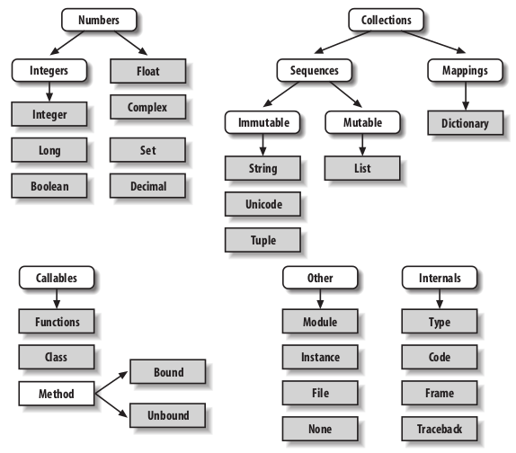
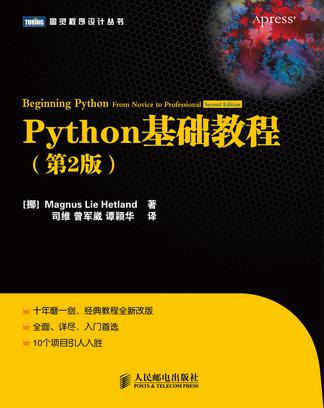

python编程
==========================

----

About
------------

.. image:: images/python-logo.gif 

- `李大双 <http://osser.me>`_
- `wiki <http://wiki.osser.me>`_
- `山东理工大学linux小组 <http://sdutlinux.org>`_
- 2011/12/03

----

The Zen of Python, by Tim Peters
--------------------------------------

.. sourcecode:: python 

    >>> import this 

:: 

        Beautiful is better than ugly.
        Explicit is better than implicit.
        Simple is better than complex.
        Complex is better than complicated.
        Flat is better than nested.
        Sparse is better than dense.
        Readability counts.
        Special cases aren't special enough to break the rules.
        Although practicality beats purity.
        Errors should never pass silently.
        Unless explicitly silenced.
        In the face of ambiguity, refuse the temptation to guess.
        There should be one-- and preferably only one --obvious way to do it.
        Although that way may not be obvious at first unless you're Dutch.
        Now is better than never.
        Although never is often better than *right* now.
        If the implementation is hard to explain, it's a bad idea.
        If the implementation is easy to explain, it may be a good idea.
        Namespaces are one honking great idea -- let's do more of those!
        

----

About python 
-------------

* 清晰，可读   
* 强大的自省能力
* 直观的面向对象
* 模块化设计
* 基于异常的错误处理
* 动态数据类型
* 广泛的库
* 可以容易的使用c/c++/java写扩展模块

---- 

解释器
------------------------ 

.. sourcecode:: python 

    Python 2.7.2+ (default, Oct  4 2011, 20:03:08) 
    [GCC 4.6.1] on linux2
    Type "help", "copyright", "credits" or "license" for more information.
    >>> 3 + 2
    5

----

注释
-------------------

.. sourcecode:: python 

    # 打印hello world
    print "hello world"

----

python类型层次
-----------------

----

数字
-------------

.. sourcecode:: python 

    >>> 3+2
    5
    >>> 2**100  #2 的100 次方
    1267650600228229401496703205376L    # L表示长整形
    >>>3//2     #双斜线表示整除
    >>>1
    >>> a=1.5+0.5j
    >>> a.real
    1.5
    >>> a.imag
    0.5

----

变量
-------------------

.. sourcecode:: python 

    >>> x = 3
    >>> x
    3

.. sourcecode:: python 
    
    >>> a,b = 1,2 
    >>> a
    1
    >>> b
    2
    >>> b,a = a,b
    >>> a
    2
    >>> b
    1

----

字符串
-------------------

.. sourcecode:: python 
    
    >>> 'spam eggs'
    'spam eggs'
    >>> 'doesn\'t'
    "doesn't"
    >>> "doesn't"
    "doesn't"
    >>> '"Yes," he said.'
    '"Yes," he said.'
    >>> "\"Yes,\" he said."
    '"Yes," he said.'
    >>> '"Isn\'t," she said.'
    '"Isn\'t," she said.'
    
* 长字符串

.. sourcecode:: python 
    

    print """
    Usage: thingy [OPTIONS]
         -h                        Display this usage message
         -H hostname               Hostname to connect to
         """
    
----

字符串处理 
------------
    >>> "hello "+"world"
    'hello world'
    >>> print "hello"+2
    Traceback (most recent call last):
      File "<stdin>", line 1, in <module>
      TypeError: cannot concatenate 'str' and 'int' objects
    >>> print "hello"+str(2)
    hello2
    >>> print "hello"+repr(2)
    hello2

* str函数，将值转换成合理形式的字符串
* repr 创建字符串，以合法的python表达式形式来表示值   

----

获取用户输入input(), raw_input()
--------------------------------------

.. sourcecode:: python 
    
    name = raw_input("whai is your name:")
    print name

----

列表
-------------------

.. sourcecode:: python 
    
    >>> a_list = ['a', 'b', 'mpilgrim', 'z', 'example']  
    >>> a_list
    ['a', 'b', 'mpilgrim', 'z', 'example']
    >>> a_list[0]                                        
    'a'
    >>> a_list[4]                                        
    'example'
    >>> a_list[-1]                                       
    'example'

----

列表切片
---------------

.. sourcecode:: python 
    
    >>> a_list
    ['a', 'b', 'mpilgrim', 'z', 'example']
    >>> a_list[1:3]            
    ['b', 'mpilgrim']
    >>> a_list[1:-1]           
    ['b', 'mpilgrim', 'z']
    >>> a_list[0:3]            
    ['a', 'b', 'mpilgrim']
    >>> a_list[:3]             
    ['a', 'b', 'mpilgrim']
    >>> a_list[3:]             
    ['z', 'example']
    >>> a_list[:]              
    ['a', 'b', 'mpilgrim', 'z', 'example']

----

列表操作
--------------

.. sourcecode:: python 

    >>> a = [66.25, 333, 333, 1, 1234.5]
    >>> print a.count(333), a.count(66.25), a.count('x')
    2 1 0
    >>> a.insert(2, -1)
    >>> a.append(333)
    >>> a
    [66.25, 333, -1, 333, 1, 1234.5, 333]
    >>> a.index(333)
    1
    >>> a.remove(333)
    >>> a
    [66.25, -1, 333, 1, 1234.5, 333]
    >>> a.reverse()
    >>> a
    [333, 1234.5, 1, 333, -1, 66.25]
    >>> a.sort()
    >>> a
    [-1, 1, 66.25, 333, 333, 1234.5]

----

元组
-------------------

.. sourcecode:: python 

    >>> t = 12345, 54321, 'hello!'
    >>> t[0]
    12345
    >>> t
    (12345, 54321, 'hello!')
    >>> # Tuples may be nested:
    ... u = t, (1, 2, 3, 4, 5)
    >>> u
    ((12345, 54321, 'hello!'), (1, 2, 3, 4, 5))

.. sourcecode:: python 
    
    >>> empty = ()
    >>> singleton = 'hello',    # <-- note trailing comma
    >>> len(empty)
    0
    >>> len(singleton)
    1
    >>> singleton
    ('hello',)

----

字典
-------------------

.. sourcecode:: python 
    
    >>> tel = {'jack': 4098, 'sape': 4139}
    >>> tel['guido'] = 4127
    >>> tel
    {'sape': 4139, 'guido': 4127, 'jack': 4098}
    >>> tel['jack']
    4098
    >>> del tel['sape']
    >>> tel['irv'] = 4127
    >>> tel
    {'guido': 4127, 'irv': 4127, 'jack': 4098}
    >>> tel.keys()
    ['guido', 'irv', 'jack']
    >>> 'guido' in tel
    True

----

集合
-------------------

.. sourcecode:: python 

    >>> basket = ['apple', 'orange', 'apple', 'pear', 'orange', 'banana']
    >>> fruit = set(basket)               # create a set without duplicates
    >>> fruit
    set(['orange', 'pear', 'apple', 'banana'])
    >>> 'orange' in fruit                 # fast membership testing
    True
    >>> 'crabgrass' in fruit
    False

    >>> # Demonstrate set operations on unique letters from two words
    ...
    >>> a = set('abracadabra')
    >>> b = set('alacazam')
    >>> a                                  # unique letters in a
    set(['a', 'r', 'b', 'c', 'd'])
    >>> a - b                              # letters in a but not in b
    set(['r', 'd', 'b'])
    >>> a | b                              # letters in either a or b
    set(['a', 'c', 'r', 'd', 'b', 'm', 'z', 'l'])
    >>> a & b                              # letters in both a and b
    set(['a', 'c'])
    >>> a ^ b                              # letters in a or b but not both
    set(['r', 'd', 'b', 'm', 'z', 'l'])

----

while 
-------------------

.. sourcecode:: python 

    >>> # Fibonacci series:
    ... # the sum of two elements defines the next
    ... a, b = 0, 1
    >>> while b < 10:
    ...     print b
    ...     a, b = b, a+b
    ...
    1
    1
    2
    3
    5
    8

----

if else elif
-------------------

.. sourcecode:: python 
    
    >>> x = int(raw_input("Please enter an integer: "))
    Please enter an integer: 42
    >>> if x < 0:
    ...      x = 0
    ...      print 'Negative changed to zero'
    ... elif x == 0:
    ...      print 'Zero'
    ... elif x == 1:
    ...      print 'Single'
    ... else:
    ...      print 'More'
    ...
    More

----

for 
-------------------

.. sourcecode:: python 
    
    >>> # Measure some strings:
    ... a = ['cat', 'window', 'defenestrate']
    >>> for x in a:
    ...     print x, len(x)
    ...
    cat 3
    window 6
    defenestrate 12

----

Looping Techniques
-------------------

.. sourcecode:: python 

    >>> knights = {'gallahad': 'the pure', 'robin': 'the brave'}
    >>> for k, v in knights.iteritems():
    ...     print k, v
    ...
    gallahad the pure
    robin the brave

break continue  
-------------------

.. sourcecode:: python 
    
    >>> for n in range(2, 10):
    ...     for x in range(2, n):
    ...         if n % x == 0:
    ...             print n, 'equals', x, '*', n/x
    ...             break
    ...     else:
    ...         # loop fell through without finding a factor
    ...         print n, 'is a prime number'
    ...
    2 is a prime number
    3 is a prime number
    4 equals 2 * 2
    5 is a prime number
    6 equals 2 * 3
    7 is a prime number
    8 equals 2 * 4
    9 equals 3 * 3

----

pass
-------------------

.. sourcecode:: python 
    
    >>> while True:
    ...     pass  # Busy-wait for keyboard interrupt (Ctrl+C)
    ...

----

函数
-------------------

.. sourcecode:: python 
    
    >>> def fib(n):    # write Fibonacci series up to n
    ...     """Print a Fibonacci series up to n."""
    ...     a, b = 0, 1
    ...     while a < n:
    ...         print a,
    ...         a, b = b, a+b
    ...
    >>> # Now call the function we just defined:
    ... fib(2000)
    0 1 1 2 3 5 8 13 21 34 55 89 144 233 377 610 987 1597

----

函数参数
-------------------

.. sourcecode:: python 
  
    def ask_ok(prompt, retries=4, complaint='Yes or no, please!'):
        while True:
            ok = raw_input(prompt)
            if ok in ('y', 'ye', 'yes'):
                return True
            if ok in ('n', 'no', 'nop', 'nope'):
                return False
            retries = retries - 1
            if retries < 0:
                raise IOError('refusenik user')
            print complaint
    
    
----

lambda
-------------------

.. sourcecode:: python 

    >>> def make_incrementor(n):
    ...     return lambda x: x + n
    ...
    >>> f = make_incrementor(42)
    >>> f(0)
    42
    >>> f(1)
    43
    

----

文档字符串
-------------------

.. sourcecode:: python 

    
    >>> def my_function():
    ...     """Do nothing, but document it.
    ...
    ...     No, really, it doesn't do anything.
    ...     """
    ...     pass
    ...
    >>> print my_function.__doc__
    Do nothing, but document it.

     No, really, it doesn't do anything.

----

模块
-------------------

.. sourcecode:: python 

    # Fibonacci numbers module
    def fib(n):    # write Fibonacci series up to n
        a, b = 0, 1
        while b < n:
            print b,
            a, b = b, a+b

    def fib2(n): # return Fibonacci series up to n
    result = []
    a, b = 0, 1
    while b < n:
        result.append(b)
        a, b = b, a+b
    return result

.. sourcecode:: python 

    >>> import fibo
    >>> fibo.fib(1000)
    1 1 2 3 5 8 13 21 34 55 89 144 233 377 610 987
    >>> fibo.fib2(100)
    [1, 1, 2, 3, 5, 8, 13, 21, 34, 55, 89]
    >>> fibo.__name__
    'fibo'

----

模块导入
-------------------

.. sourcecode:: python 
    
    >>> from fibo import fib, fib2

.. sourcecode:: python 

    >>> from fibo import *

----

异常处理
-------------------

.. sourcecode:: python 
    
    >>> while True:
    ...     try:
    ...         x = int(raw_input("Please enter a number: "))
    ...         break
    ...     except ValueError:
    ...         print "Oops!  That was no valid number.  Try again..."
    ...

    
.. sourcecode:: python 
    
    ... except (RuntimeError, TypeError, NameError):
    ...     pass

----

异常其它写法
-------------------

.. sourcecode:: python 

    try:
        
    except Exception, e:
        raise e
    else:
        pass

.. sourcecode:: python 
    
    try:
        
    except Exception, e:
        raise e
    finally:
        pass

.. sourcecode:: python 
    
    try:
        
    except Exception, e:
        raise e
    else:
        pass
    finally:
        pass
        

----

class
-------------------

.. sourcecode:: python 

    class MyClass:
        """A simple example class"""
        i = 12345
        def f(self):
            return 'hello world'

    x = MyClass()

.. sourcecode:: python 

    >>> class Complex:
    ...     def __init__(self, realpart, imagpart):
    ...         self.r = realpart
    ...         self.i = imagpart
    ...
    >>> x = Complex(3.0, -4.5)
    >>> x.r, x.i
    (3.0, -4.5)

----

其它
---------------

入门图书

